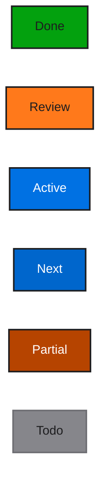
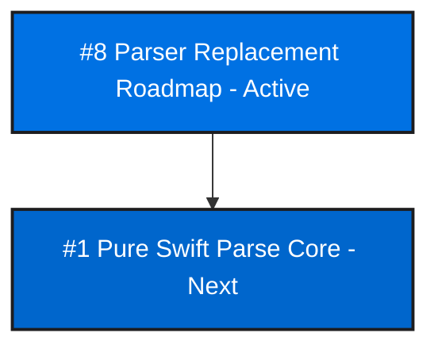
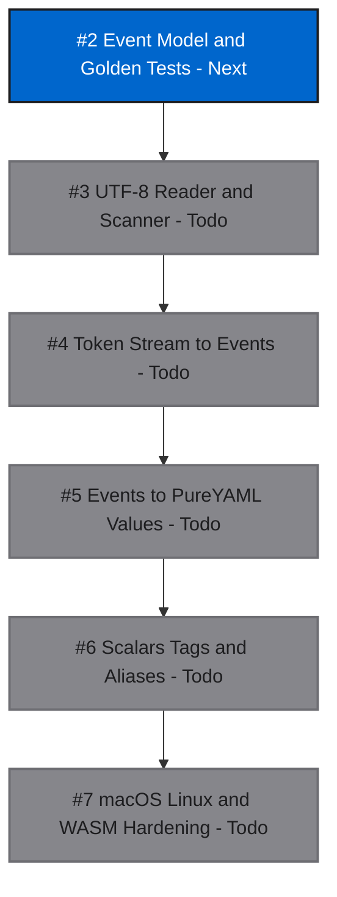

# PureYAML

[](https://github.com/mihaelamj/PureYAML/actions/workflows/ci.yml)

PureYAML is a dependency-free YAML package written entirely in Swift.

The goal is a Linux- and WebAssembly-compatible replacement for the YAML pieces
that currently force packages such as OpenAPIDoctor through C-backed parsers.
The package is intentionally strict about portability:

- no external SwiftPM dependencies
- no bundled C sources
- no Foundation requirement in the library target
- root Swift package layout
- macOS, Linux, and WASI build gates

## Roadmap

Mermaid status legend:

The roadmap uses colors from apple.com CSS: web button blue for active,
link blue for next, green for done, orange for review, deep orange for partial,
and secondary gray for todo.



Epics overview:



Parse core detailed roadmap:



## Status

This repository starts with the first real parser milestone: block mappings,
block sequences, ordered mappings, common scalars, quoted strings, comments, and
a matching dumper. It also includes path-aware validation for structural YAML
checks such as duplicate mapping keys.

It is not yet a full YAML 1.2 implementation. Anchors, aliases, tags, flow
collections, folded scalars, literal scalars, directives, and custom decoding
are planned work.

## Attribution

PureYAML is informed by Yams and its bundled `CYaml` / libyaml-derived parser,
but it does not copy their implementation into `Sources/`. See
[ATTRIBUTION.md](ATTRIBUTION.md).

## Usage

```swift
import PureYAML

let document = try PureYAML.parse("""
openapi: 3.1.0
info:
  title: Example API
servers:
  - url: /
""")

let yaml = PureYAML.dump(document)

try PureYAML.validate(document)
```

## Development Contract

PureYAML must stay dependency-free and portable. Before merging changes:

```sh
bash scripts/check-style.sh
bash scripts/check-namespacing.sh
bash scripts/check-changelog-touched.sh
bash scripts/check-roadmap.sh
swiftformat . --config .swiftformat --lint
swiftlint --config .swiftlint.yml --strict
swift build
swift test
bash scripts/check-linux.sh
bash scripts/check-wasm.sh
```

`scripts/check-wasm.sh` expects a Swift toolchain with a matching Swift Wasm SDK.
For Swift 6.3.2, install the SDK with:

```sh
swift sdk install https://download.swift.org/swift-6.3.2-release/wasm-sdk/swift-6.3.2-RELEASE/swift-6.3.2-RELEASE_wasm.artifactbundle.tar.gz --checksum a61f0584c93283589f8b2f42db05c1f9a182b506c2957271402992655591dd7c
```

## License

MIT.
