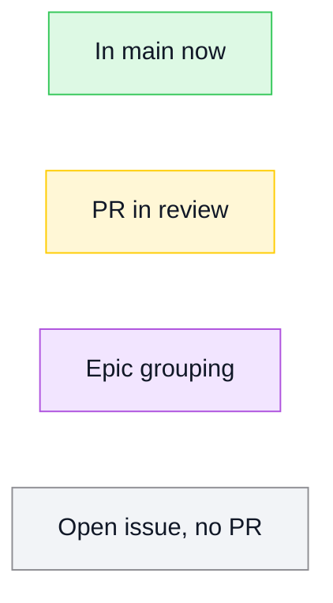
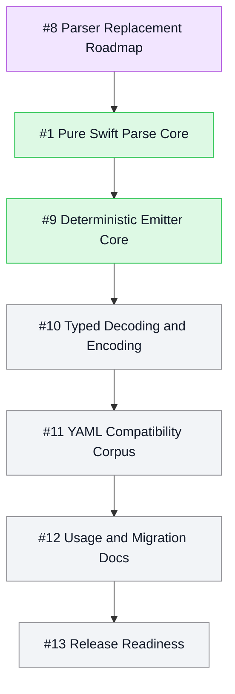

# PureYAML

[](https://github.com/mihaelamj/PureYAML/actions/workflows/ci.yml)

PureYAML is a dependency-free YAML package written entirely in Swift.

The goal is a Linux- and WebAssembly-compatible replacement for the YAML pieces
that currently force packages such as OpenAPIDoctor through C-backed parsers.
The package is intentionally strict about portability:

- no external SwiftPM dependencies
- no bundled C sources
- no Foundation requirement in the library target
- root Swift package layout
- macOS, Linux, and WASI build gates

## Roadmap

Mermaid status legend:

The roadmap uses the TileDown Mermaid palette: green for merged work, yellow for
review, purple for epic grouping, and gray for open work with no PR.



Epics overview:



#9 Deterministic Emitter Core is complete in main.

## Status

This repository starts with the first real parser milestone: block mappings,
block sequences, ordered mappings, common scalars, quoted strings, comments,
flow collections, literal and folded block scalars, anchors, aliases, YAML
directives, document markers, explicit built-in scalar tags, and a matching
dumper with block and flow output policies. It also includes path-aware
validation for structural YAML checks such as duplicate mapping keys.

It is not yet a full YAML 1.2 implementation. The internal event parser now
recognizes anchors, aliases, tags, flow collections, and block scalar styles from
scanner tokens, and the public value parser composes those events into
`PureYAML.Model.Value`. Full tag-specific collection semantics, multi-document
streams, merge keys, directives beyond the selected compatibility subset, and
custom decoding are planned work.

## Attribution

PureYAML is informed by Yams and its bundled `CYaml` / libyaml-derived parser,
but it does not copy their implementation into `Sources/`. See
[ATTRIBUTION.md](ATTRIBUTION.md).

## Usage

```swift
import PureYAML

let document = try PureYAML.parse("""
openapi: 3.1.0
info:
  title: Example API
servers:
  - url: /
""")

let yaml = PureYAML.dump(document)

try PureYAML.validate(document)
```

Typed scalar conversion is available for the first Decodable and Encodable
slice:

```swift
let title = try PureYAML.decode(String.self, from: "Example")
let value = try PureYAML.encode(42)
let yaml = try PureYAML.encodeToYAML(true)
```

Emitter options are explicit. The default is deterministic block-style output
with quoted strings. Callers can opt into conservative plain strings, safe
literal block scalars for multiline strings, and compact flow collections:

```swift
let readable = PureYAML.Emitting.Options(
    scalarStyle: .literalBlockWhenMultiline
)

let compact = PureYAML.Emitting.Options(collectionStyle: .flow)

let yaml = PureYAML.dump(document, options: readable)
let compactYAML = PureYAML.dump(document, options: compact)
```

Literal block emission is intentionally conservative: multiline strings whose
lines would not round-trip through the current parser are emitted as quoted
strings instead. Flow collections always use inline scalar output.

## Validation

Validation is path-aware and explicit. The default validator rejects duplicate
mapping keys anywhere in a parsed document. Callers can use strict mode, where
warnings fail validation, or non-strict mode, where warnings are returned while
errors still throw.

```swift
let issues = try PureYAML.validate(document, strict: false)
```

Custom validation rules can be layered onto the default validator or attached to
a blank validator when callers want only project-specific checks. Validation
tests pin exact issue paths, descriptions, severity handling, rule traversal
order, strict/non-strict behavior, and duplicate-key diagnostics.

## Development Contract

PureYAML must stay dependency-free and portable. Before merging changes:

```sh
bash scripts/check-all.sh
```

That command expands to:

```sh
bash scripts/check-style.sh
bash scripts/check-namespacing.sh
bash scripts/check-changelog-touched.sh
bash scripts/check-roadmap.sh
swiftformat . --config .swiftformat --lint
swiftlint --config .swiftlint.yml --strict
swift build
swift test
bash scripts/check-linux.sh
bash scripts/check-wasm.sh
```

The pre-push hook runs `scripts/check-all.sh` so local pushes exercise macOS,
Claw Mini Linux, and WASM before hosted CI repeats the macOS, Linux, and WASM
matrix.

`scripts/check-wasm.sh` expects a Swift toolchain with a matching Swift Wasm SDK.
For Swift 6.3.2, install the SDK with:

```sh
swift sdk install https://download.swift.org/swift-6.3.2-release/wasm-sdk/swift-6.3.2-RELEASE/swift-6.3.2-RELEASE_wasm.artifactbundle.tar.gz --checksum a61f0584c93283589f8b2f42db05c1f9a182b506c2957271402992655591dd7c
```

## License

MIT.
