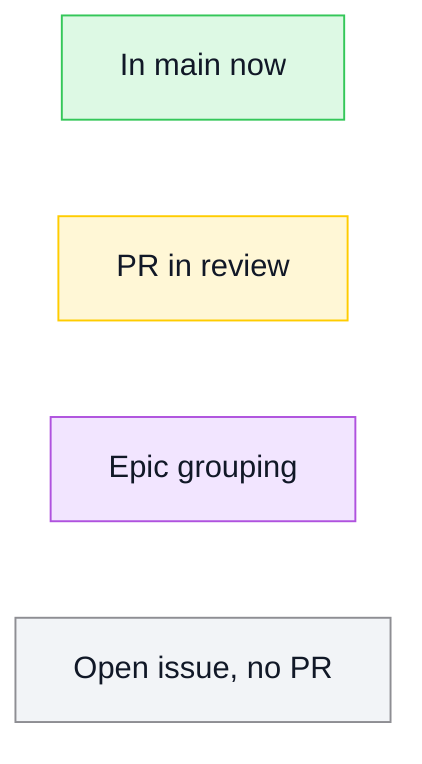
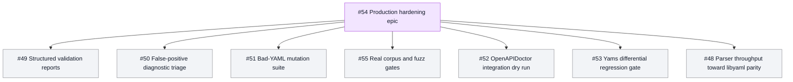

# PureYAML

[](https://github.com/mihaelamj/PureYAML/actions/workflows/ci.yml)
[](https://github.com/mihaelamj/PureYAML/actions/workflows/ci.yml)
[](https://github.com/mihaelamj/PureYAML/actions/workflows/ci.yml)
[](https://github.com/mihaelamj/PureYAML/actions/workflows/ci.yml)

PureYAML is a dependency-free YAML package written entirely in Swift.

The goal is a Linux-, Windows-, and WebAssembly-compatible replacement for the
YAML pieces that currently force packages such as OpenAPIDoctor through
C-backed parsers. The package is intentionally strict about portability:

- no external SwiftPM dependencies
- no bundled C sources
- no Foundation requirement in the library target
- root Swift package layout
- macOS, Linux, Windows, and WASI build gates

## Roadmap

Mermaid status legend:

The roadmap uses the TileDown Mermaid palette: green for merged work, yellow for
review, purple for epic grouping, and gray for open work with no PR.



Parser Replacement Roadmap #8 is complete in main.

Production Hardening and Validation Readiness #54 is active. It tracks the
remaining production-readiness work after current Yams parse-success parity on
the checked corpus:



## Status

The current release is 0.1.1. It includes block mappings, block sequences,
ordered mappings, common scalars, quoted strings, comments, flow collections,
literal and folded block scalars, anchors, aliases, YAML directives, document
markers, explicit built-in scalar tags, merge-key expansion, complex mapping keys,
multi-document stream parsing, and a matching dumper with block and flow output
policies, including multi-document stream dumping with explicit document starts.
It also includes path-aware validation for structural YAML checks such as
duplicate mapping keys, stream validation that preserves document indexes, and
diagnostic-first validation reports for damaged YAML input.
Callers that need explicit tag metadata can use `PureYAML.parseTagged(_:)` or
`PureYAML.parseTaggedStream(_:)` and run tagged validation over the preserved
source-shaped node tree.

It is not yet a full YAML 1.2 implementation. The internal event parser now
recognizes anchors, aliases, tags, flow collections, and block scalar styles from
scanner tokens, and the public value parser composes those events into
`PureYAML.Model.Value`. The tagged parser preserves explicit scalar and
collection tags without adding Foundation-backed constructors; callers can opt
into `PureYAML.Tagged.Constructor` when they want a typed, project-owned
construction policy. Use normal parsing when semantic merge-key expansion is
required. Directives beyond the selected compatibility subset and automatic
`Data`/`Date` construction remain out of scope for the library target.
Unsupported gaps are pinned by executable tests so they produce exact errors,
exact validation issues, or exact fallback value trees instead of silent parser
drift.

## Attribution

PureYAML is informed by Yams and its bundled `CYaml` / libyaml-derived parser,
but it does not copy their implementation into `Sources/`. See
[ATTRIBUTION.md](ATTRIBUTION.md).

## Documentation

- [Usage](docs/USAGE.md): public APIs, validation, emitter options, and
  cross-platform gates.
- [Corpus gates](docs/CORPUS.md): real-world YAML seed sources, generated
  mutations, artifact format, and hardening acceptance criteria.
- [Migration and support boundaries](docs/MIGRATION.md): what PureYAML can
  replace today and which YAML features are deliberately unsupported.
- [Release process](docs/RELEASE.md): verification commands, tag commands, and
  release-publishing steps.

## Usage

The examples in this section are covered by
`Tests/DocumentationExampleTests.swift`.

```swift
import PureYAML

let document = try PureYAML.parse("""
openapi: 3.1.0
info:
  title: Example API
servers:
  - url: /
""")

let yaml = PureYAML.dump(document)

try PureYAML.validate(document)
```

Use `parseTagged(_:)` when the caller needs to inspect explicit tags before
project-specific construction:

```swift
let tagged = try PureYAML.parseTagged("""
value: !!timestamp 2001-01-23
""")

let tagIssues = PureYAML.Tagged.Validator().collect(tagged)
```

Use `PureYAML.Tagged.Constructor` when a project owns a custom tag policy:

```swift
let env = try PureYAML.Tagged.Constructor<String>()
    .constructingScalar(tag: .init("!Env")) { scalar, _ in
        scalar.rawValue
    }
    .construct(try PureYAML.parseTagged("!Env DATABASE_URL"))
```

Use `parseStream(_:)` when the input may contain more than one YAML document.
Each returned document carries its stream index, and validation preserves that
index when reporting issues:

```swift
let documents = try PureYAML.parseStream("""
---
title: First
---
- Swift
- YAML
""")

try PureYAML.validate(documents)
let streamYAML = PureYAML.dump(documents)
```

Typed conversion is available for scalar values, keyed mapping-backed structs,
dictionary-like string mappings, unkeyed sequences, nested containers, and
keyed super coders:

```swift
struct Info: Codable {
    var title: String
    var version: Int
}

let title = try PureYAML.decode(String.self, from: "Example")
let info = try PureYAML.decode(Info.self, from: """
title: Example API
version: 1
""")
let tags = try PureYAML.decode([String].self, from: """
- Swift
- YAML
""")
let value = try PureYAML.encode(42)
let yaml = try PureYAML.encodeToYAML(info)
```

Typed decoding runs the default validator before constructing Swift values, so
duplicate mapping keys are reported as validation issues instead of silently
choosing one value.

Complex mapping keys are available through `PureYAML.Model.Pair.keyNode`.
String-keyed lookup and keyed `Codable` remain string-only, while model
inspection, validation, and dumping preserve sequence and mapping keys.

Emitter options are explicit. The default is deterministic block-style output
with quoted strings. Callers can opt into conservative plain strings, safe
literal block scalars for multiline strings, and compact flow collections:

```swift
let readable = PureYAML.Emitting.Options(
    scalarStyle: .literalBlockWhenMultiline
)

let compact = PureYAML.Emitting.Options(collectionStyle: .flow)

let yaml = PureYAML.dump(document, options: readable)
let compactYAML = PureYAML.dump(document, options: compact)
```

Literal block emission is intentionally conservative: multiline strings whose
lines would not round-trip through the current parser are emitted as quoted
strings instead. The policy allows more plain-safe block content, such as
hashes without comment boundaries and indicator-like text that the parser keeps
as scalar content. Flow collections always use inline scalar output.

## Validation

Validation is path-aware and explicit. The default validator rejects duplicate
mapping keys anywhere in a parsed document. Callers can use strict mode, where
warnings fail validation, or non-strict mode, where warnings are returned while
errors still throw.

```swift
let issues = try PureYAML.validate(document, strict: false)
```

For production-style validation over many YAML inputs, use the non-throwing
report API. It validates every source, turns parse failures into diagnostics,
and can render Markdown, YAML, or JSON that a consuming tool writes to disk:

```swift
let report = PureYAML.validationReports([
    .init(name: "valid.yaml", yaml: "title: Ready"),
    .init(name: "broken.yaml", yaml: "title: \"open"),
])

let markdown = report.markdownDescription(title: "YAML Validation")
let yaml = report.yamlDescription(title: "YAML Validation")
let json = report.jsonDescription(title: "YAML Validation")
```

For production tools that need an error body for damaged YAML, use the
diagnostic-first APIs. They scan the raw source for common spacing and control
character problems before parsing, then include parser and model-validation
diagnostics in the same report. `parseValidated(_:)` and
`parseValidatedStream(_:)` throw `PureYAML.Validation.ReportError` when the
input cannot safely produce parsed artifacts:

```swift
do {
    let document = try PureYAML.parseValidated(yaml, file: "openapi.yaml")
    try PureYAML.validate(document)
} catch let error as PureYAML.Validation.ReportError {
    let body = error.report.jsonDescription(title: "YAML Validation")
    // Return body from the application-owned CLI or HTTP error response.
}
```

Custom validation rules can be layered onto the default validator or attached to
a blank validator when callers want only project-specific checks. Validation
tests pin exact issue paths, descriptions, severity handling, rule traversal
order, strict/non-strict behavior, and duplicate-key diagnostics.

## Development Contract

PureYAML must stay dependency-free and portable. Before merging changes:

- Swift tools version: 6.1
- Package products: `PureYAML`
- SwiftPM dependencies: none
- Hosted CI matrix: macOS build and test, Linux build and test, Windows build
  and test, WASM build

```sh
bash scripts/check-all.sh
```

That command expands to:

```sh
bash scripts/check-style.sh
bash scripts/check-namespacing.sh
bash scripts/check-forbidden-patterns.sh
bash scripts/check-changelog-touched.sh
bash scripts/check-roadmap.sh
swiftformat . --config .swiftformat --lint
swiftlint --config .swiftlint.yml --strict
swift build
swift test
bash scripts/check-linux.sh
bash scripts/check-wasm.sh
```

The pre-push hook runs `scripts/check-all.sh` so local pushes exercise macOS,
Claw Mini Linux, and WASM before hosted CI repeats those gates and adds Windows.

`scripts/check-wasm.sh` expects a Swift toolchain with a matching Swift Wasm SDK.
For Swift 6.3.2, install the SDK with:

```sh
swift sdk install https://download.swift.org/swift-6.3.2-release/wasm-sdk/swift-6.3.2-RELEASE/swift-6.3.2-RELEASE_wasm.artifactbundle.tar.gz --checksum a61f0584c93283589f8b2f42db05c1f9a182b506c2957271402992655591dd7c
```

## License

MIT.
