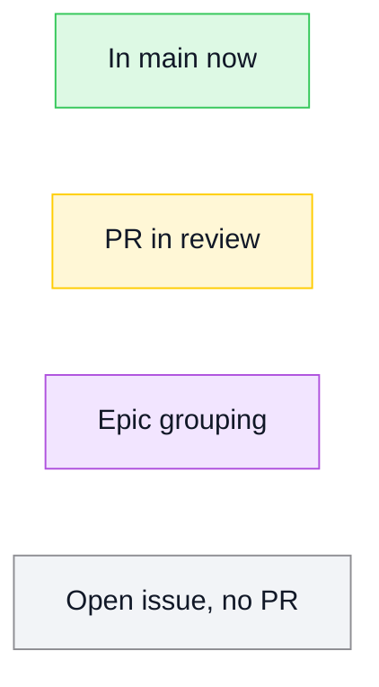

# Mermaid Rules

## Rule 1: Use the TileDown Mermaid palette

Every Mermaid roadmap diagram in this repository must use TileDown's Mermaid
status classes and exact colors.

Allowed classes:

- `done`: merged or shipped work
- `review`: pull request in review
- `epic`: grouping issue or roadmap parent
- `todo`: open work with no PR

Do not add ad-hoc Mermaid status colors. Add a new class only after TileDown's
Mermaid palette adds the same class.

## Rule 2: Keep roadmap Mermaid mechanically checkable

Roadmap Mermaid blocks must keep `classDef` lines before nodes and edges. Every
node must use one of the allowed classes, and every edge must reference nodes
already defined in that block.

The README must start its Mermaid section with the shared legend. Run
`bash scripts/check-roadmap.sh` after changing roadmap diagrams.
